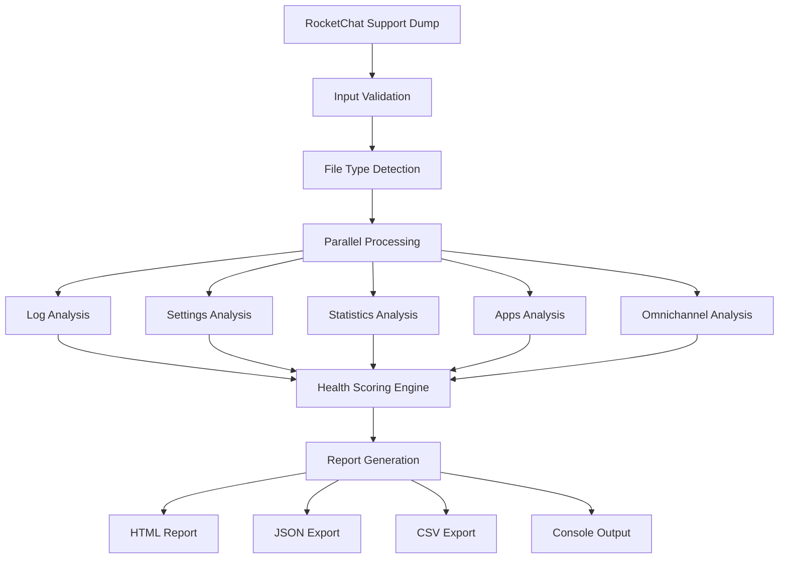

# 🏗️ Architecture Documentation

## Overview

The RocketChat Support Dump Analyzer is designed as a modular, cross-platform automation tool that provides comprehensive analysis of RocketChat deployments through support dumps.

## Core Components

### 🔧 Analysis Engine

**PowerShell Implementation** (`scripts/Analyze-RocketChatDump.ps1`)
- Primary implementation with full feature set
- Modular architecture using PowerShell modules
- Advanced error handling and logging
- Native Windows integration with cross-platform support

**Bash Implementation** (`scripts/analyze-rocketchat-dump.sh`)
- Feature-parity implementation for Linux/macOS
- JSON processing using `jq`
- HTML report generation with embedded JavaScript
- Shell-native performance optimizations

### 📦 PowerShell Modules

**RocketChatLogParser.psm1**
- Log file parsing and normalization
- Pattern matching for error detection
- Time series analysis for performance trends

**RocketChatAnalyzer.psm1**
- Core analysis algorithms
- Health scoring calculation
- Security vulnerability detection
- Performance metric evaluation

**ReportGenerator.psm1**
- Multi-format report generation (HTML, JSON, CSV, Console)
- Template-based reporting system
- Interactive chart generation
- Export functionality

### 🎯 Entry Points

**Root Level Wrappers**
- `analyze.ps1/.sh/.bat` - Simple analysis entry points
- `test.ps1/.sh/.bat` - Testing and validation entry points
- Provide clean user interface while maintaining organized structure

### 🧪 Testing Framework

**Production Readiness Suite** (`tests/Production-Readiness-Test.ps1`)
- Comprehensive validation testing
- Performance benchmarking
- Feature parity verification
- Cross-platform compatibility testing
- Real-world scenario simulation

**Quick Validation** (`tests/Quick-CrossPlatform-Test.ps1`)
- Rapid functionality verification
- Basic compatibility testing
- Automated dump detection
- Quick health checks

**Platform-Specific Tests**
- Windows: `.ps1` and `.bat` scripts
- Linux/macOS: `.sh` scripts
- Cross-platform: PowerShell Core support

## Data Flow



## Security Architecture

### 🔒 Security Analysis Components

1. **Configuration Validation**
   - Security settings audit
   - Access control verification
   - Encryption configuration check

2. **Log Security Analysis**
   - Failed authentication detection
   - Suspicious activity patterns
   - Security event correlation

3. **App Security Review**
   - Installed app permissions
   - Third-party integration security
   - API access patterns

### 🛡️ Data Protection

- No sensitive data storage
- Local processing only
- Configurable data retention
- Secure cleanup procedures

## Performance Architecture

### ⚡ Optimization Strategies

1. **Parallel Processing**
   - Concurrent file analysis
   - Multi-threaded operations
   - Resource pool management

2. **Memory Management**
   - Streaming file processing
   - Garbage collection optimization
   - Memory usage monitoring

3. **Caching Mechanisms**
   - Configuration caching
   - Pattern matching optimization
   - Result memoization

### 📊 Performance Metrics

- Processing speed benchmarks
- Memory usage tracking
- File size handling limits
- Concurrent operation scaling

## Extensibility Framework

### 🔌 Plugin Architecture

1. **Analysis Modules**
   - Custom analysis rule injection
   - External pattern libraries
   - Third-party integration hooks

2. **Report Templates**
   - Custom HTML templates
   - Branding customization
   - Format extensions

3. **Configuration System**
   - JSON-based rule definitions
   - Environment-specific settings
   - Dynamic rule loading

### 📋 Configuration Schema

```json
{
  "analysisRules": {
    "logPatterns": [...],
    "securityChecks": [...],
    "performanceThresholds": {...}
  },
  "reportSettings": {
    "templates": {...},
    "branding": {...},
    "outputs": [...]
  }
}
```

## Cross-Platform Compatibility

### 🖥️ Platform Support Matrix

| Feature | Windows PS | Linux PS | macOS PS | Linux Bash | macOS Bash |
|---------|------------|----------|----------|------------|------------|
| Core Analysis | ✅ | ✅ | ✅ | ✅ | ✅ |
| HTML Reports | ✅ | ✅ | ✅ | ✅ | ✅ |
| JSON Export | ✅ | ✅ | ✅ | ✅ | ✅ |
| CSV Export | ✅ | ✅ | ✅ | ✅ | ✅ |
| Interactive Charts | ✅ | ✅ | ✅ | ✅ | ✅ |
| Browser Integration | ✅ | ✅ | ✅ | ✅ | ✅ |

### 🔄 Feature Parity

Both PowerShell and Bash implementations maintain functional parity through:
- Shared configuration files
- Standardized output formats
- Common analysis algorithms
- Unified testing framework

## Deployment Architecture

### 📦 Deployment Options

1. **Standalone Execution**
   - No installation required
   - Portable script package
   - Self-contained dependencies

2. **Production Integration**
   - CI/CD pipeline integration
   - Automated analysis scheduling
   - Enterprise reporting systems

3. **Development Environment**
   - Interactive testing tools
   - Debug output modes
   - Performance profiling

### 🔧 Maintenance

- Automated testing on multiple platforms
- Version compatibility checking
- Performance regression testing
- Security vulnerability scanning

## Future Architecture Plans

### 🚀 Planned Enhancements

1. **Microservices Architecture**
   - API-based analysis services
   - Containerized deployments
   - Scalable processing clusters

2. **Real-time Analysis**
   - Live log monitoring
   - Streaming data processing
   - Alert generation systems

3. **Machine Learning Integration**
   - Anomaly detection algorithms
   - Predictive analysis capabilities
   - Automated pattern discovery

4. **Web Interface**
   - Browser-based management
   - Remote analysis capabilities
   - Collaborative reporting features

This architecture provides a solid foundation for reliable, scalable, and maintainable RocketChat support dump analysis while supporting future growth and enhancement opportunities.
